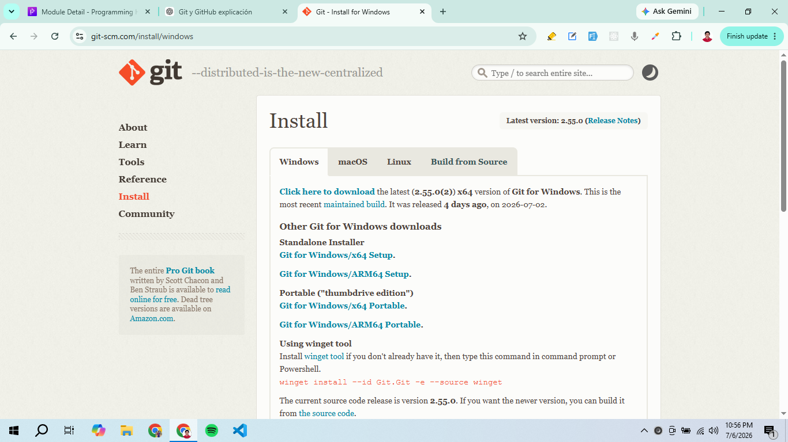

<h1 align="center">Git and Github Notes</h1>

- [1. Introduction:](#1-introduction)
  - [1.1. Setup:](#11-setup)
  - [1.2. What is Git and GitHub?](#12-what-is-git-and-github)

# 1. Introduction:
## 1.1. Setup:
- For git we just need to install the git software on our computer.

- For GitHub we need to create an account on the GitHub website. 

## 1.2. What is Git and GitHub?
- Git is a local version control system that helps us to track changes in our code. 
- On the other hand, GitHub is a cloud platform where we can store and share Git repositories online.     

Note: GitLab, Bitbucket etc are the alternatives to GitHub.

