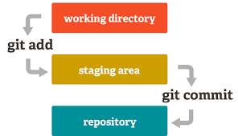
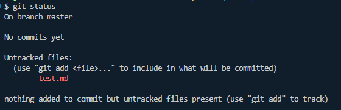
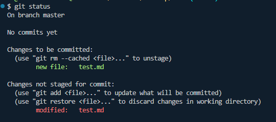
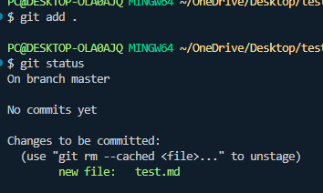
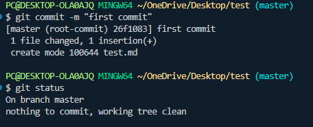

<h1 align="center">Git Notes</h1>

- [1. Introduction:](#1-introduction)
  - [1.1. Setup:](#11-setup)
  - [1.2. What is Git and GitHub?](#12-what-is-git-and-github)
  - [1.3. What is Version Control System:](#13-what-is-version-control-system)
  - [1.4. Types of Version Control System:](#14-types-of-version-control-system)
    - [1.4.1. Centralized Version Control (CVCS):](#141-centralized-version-control-cvcs)
    - [1.4.2. Distributed Version Control (DVCS):](#142-distributed-version-control-dvcs)
  - [1.5. Key Git Concepts:](#15-key-git-concepts)
  - [1.6. Why Git:](#16-why-git)
- [2. Git stages and status:](#2-git-stages-and-status)


# 1. Introduction:
## 1.1. Setup:

- step 1: install git software
- step 2: configure git with name and email:

```bash
git config --global user.name "Your Name"
git config --global user.email "your.email@example.com"
```

For checking the configuration, we can use this command:

```bash
git config --list

# or if we want to check a specific configuration, we can use this command:
git config user.name
git config user.email

# or if we want to check a specific global configuration, we can use this command:
git config --global user.name
git config --global user.email
```

- step 2: sign up on github 
- step 3: create a new repository on GitHub 
- step 4: create a new project folder on our computer and do this command in the terminal once inside the project folder: 

```bash
git init
git add . 
git commit -m "first commit"
git branch -M main
git remote add origin https://github.com/muhammad-tamim/test.git
git push -u origin main
```

here, 
  - `git init` initializes a new Git repository in the current folder.
  - `git add .` stages all the files in the current folder for the next commit.
    - you can use `git add <file_name>` to stage a specific file.
  - `git commit -m "first commit"` creates a new commit (snapshot) with the staged files and a message describing the changes.
  - `git branch -M main` renames the default branch to "main".
  - `git remote add origin https://github.com/muhammad-tamim/test.git` adds a remote repository named "origin" with the specified URL.
  - `git push -u origin main` pushes the local "main" branch to the remote repository and sets it as the upstream branch.
  - `git push` uploads the local commits to the remote repository.

Note: after this `git remote add origin https://github.com/muhammad-tamim/test.git` command we need to sign in to our github by browser.


- step 5: after that we can do the following commands to push our changes to github:

```bash
git add .
git commit -m "message"
git push
```


## 1.2. What is Git and GitHub?
- Git is a distributed version control system that helps us to track changes in our code. 
- On the other hand, GitHub is a cloud platform where we can store and share Git repositories online.     
  - GitLab, Bitbucket etc are the alternatives of GitHub.

**Note:** Most Git actions happens on our own computer and cloud platforms like GitHub are used to share our code with others.

## 1.3. What is Version Control System:
A Version Control System (VCS) is a tool that records every changes we make to our project over time.

Imagine you're writing a report:

```
report.doc
report_final.doc
report_final_v2.doc
report_final_v3.doc
report_final_REAL_FINAL.doc
```

This quickly becomes messy. Git solves this by storing every version of your project in a structured history:

```
report = Version 1 → Version 2 → Version 3 → Version 4
```

now we can easily go back to any previous version, see what changed, Compare any two versions and collaborate with others without losing anything.

## 1.4. Types of Version Control System:
There are two types of version control systems:

1. Centralized Version Control Systems: All version history is stored on a central server.
2. Distributed Version Control Systems: Each developer has a complete copy of the repository, including its history.

### 1.4.1. Centralized Version Control (CVCS): 

```
               Central Server
             +---------------+
             |  Project Code |
             +---------------+
             /       |       \
            /        |        \
        Alice      Bob      Charlie
```

- Everyone depends on one central server.
- If the server goes down, nobody can work properly.
- Our computer usually has only the latest copy, not the complete history.

### 1.4.2. Distributed Version Control (DVCS):

```
              GitHub (Remote)
            +----------------+
            | Full History  |
            +----------------+
               /    |    \
              /     |     \

       Alice         Bob        Charlie
    +-----------+ +-----------+ +-----------+
    | Full Repo | | Full Repo | | Full Repo |
    | + History | | + History | | + History |
    +-----------+ +-----------+ +-----------+
```
here every developer has: 
- The entire project
- Every commit ever made
- Every branch
- The complete history

That's why Git is called distributed.


## 1.5. Key Git Concepts: 
- Repository: A folder where Git tracks your project and its history.
- Clone: Make a copy of a remote repository on your computer.
- Stage: Tell Git which changes you want to save next.
- Commit: Save a snapshot of your staged changes.
- Branch: Work on different versions or features at the same time.
- Merge: Combine changes from different branches.
- Pull: Get the latest changes from a remote repository.
- Push: Send your changes to a remote repository.

## 1.6. Why Git: 
- Version history – You can see what changed, when, and by whom.
- Undo mistakes – Revert to earlier versions if something breaks.
- Collaboration – Multiple developers can work on the same project simultaneously.
- Branching and merging – Experiment with features in separate branches and merge them later.
- Backup and synchronization – Services like GitHub, GitLab, and Bitbucket can host Git repositories online.

# 2. Git stages and status: 



There are three main stages in Git:
1. Working Directory: This is where we make changes to our files before they are tracked by Git. It shows a status called `untracked` for new files and `modified` for existing files that have been changed but not yet staged.




2. Staging Area: This is where we used command like `git add filename` or `git add .`  to stage our changes for commit. It shows a status called `staged or added` for files that are ready to be committed. 
   - We can use `git reset filename` to unstage a file or `git reset` to unstage all files if we change our mind.



3. Repository: This is where we used `git commit -m "Meaningful message"` to commit our changes. Once we commit our changes, they become part of the repository's history. It shows 


